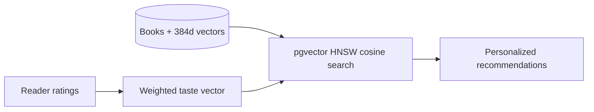

# Book Recommender

A FastAPI website for finding books based on what you enjoyed reading. Search a
catalog, rate books from one to five stars, revisit your reading list, and get
recommendations from a weighted semantic profile of your ratings.

PostgreSQL and pgvector provide cosine similarity search over 384-dimensional
book embeddings, with an HNSW index. Docker Compose starts the website with a
ready-to-use 600-book demo catalog, so trying it does not require a Kaggle
account or an embedding job.

## Features

- Search the catalog by title and view book descriptions and metadata.
- Keep a personal reading list and update ratings.
- Get semantic recommendations after rating a book at least three stars.
- Browse a varied discovery list before you have positive ratings.
- Use JSON search and rating endpoints alongside the web interface.

The weighted TF-IDF implementation remains available in
`app/recommenders/tfidf.py` for offline use, but it is not imported or used by
the website.

## Quick start

Requirements: Docker Engine with Compose v2.

```bash
cp .env.example .env
# Replace both placeholder secrets in .env.
docker compose up --build -d
```

Open [http://localhost:8000](http://localhost:8000). The first run migrates the
database and loads a deterministic 600-book CC0 demo catalog with precomputed
semantic embeddings. Choose **Add a read**, search for a book, and rate it to
personalize the home page. Re-running the seed is safe because ingestion is an
upsert.

```bash
docker compose ps
docker compose logs -f web
docker compose down
```

The database lives in the `postgres_data` named volume. PostgreSQL is attached
only to an internal Docker network; only FastAPI publishes a host port. Run
`docker compose down -v` if you also want to delete the database volume.

## Full catalog ingestion

The source is Elvin Rustamov's 103,063-row
[Books Dataset](https://www.kaggle.com/datasets/elvinrustam/books-dataset),
released under CC0. Cleaning removes blank titles and title duplicates, yielding
97,805 books in the current artifact.

Generate embeddings outside request handling. The first run downloads the
`all-MiniLM-L6-v2` model, and processing the full catalog can take a while:

```bash
python -m venv .venv
.venv/bin/pip install -r requirements-ml.txt
.venv/bin/python -m scripts.embed \
  --dataset /path/to/BooksDatasetClean.csv
```

For an already running Docker database, mount the dataset, vectors, and metadata:

```bash
export DATASET_PATH=/absolute/path/BooksDatasetClean.csv
export EMBEDDINGS_PATH=/absolute/path/semantic_embeddings.npy
export EMBEDDINGS_METADATA_PATH=/absolute/path/semantic_embeddings_metadata.json
make ingest-full
```

The metadata fingerprint prevents vectors from being paired with the wrong
cleaned row order. Large generated artifacts and credentials are Git-ignored.
See [data/README.md](data/README.md) for details about the bundled demo data.

## Recommendation behavior



Five-star books contribute 3×, four-star books 2×, and three-star books 1× to
the semantic profile. One- and two-star books are excluded from results without
pulling the positive profile toward a disliked title. Already-rated books are
never recommended.

This release uses signed anonymous browser profiles rather than login accounts.
Reading history is tied to that browser and does not sync across devices. Add
account-based identity before exposing personal reading histories as a shared
public service.

## Configuration

Copy `.env.example` for the Docker Compose defaults. The main settings are:

| Variable | Purpose |
| --- | --- |
| `APP_PORT` | Host port for the web app (default `8000`). |
| `POSTGRES_DB`, `POSTGRES_USER`, `POSTGRES_PASSWORD` | Database credentials. |
| `SECRET_KEY` | Signs reader sessions and CSRF tokens. |
| `ALLOWED_HOSTS` | Comma-separated hostnames accepted by the app. |
| `SESSION_COOKIE_SECURE` | Set to `true` when serving over HTTPS. |

## Architecture

```text
app/
├── api/              FastAPI HTML, JSON, and health routes
├── repositories/     parameterized PostgreSQL queries
├── recommenders/     semantic tools and an offline-only TF-IDF implementation
├── static/            responsive CSS and progressive JS
└── templates/         Jinja pages and reusable cards/rating controls
migrations/            Alembic schema and pgvector/pg_trgm indexes
scripts/               ingestion, embedding, and demo-data generation
tests/                 recommender and end-to-end rating-flow checks
```

`app/main.py` is intentionally limited to application assembly, middleware, and
router registration. Database writes use bound parameters and transactions.
Ratings are protected with signed sessions, SameSite cookies, and CSRF checks.
Security headers, trusted-host validation, readiness/liveness endpoints,
non-root containers, read-only runtime filesystem, dropped Linux capabilities,
and pinned top-level dependencies are included.

For HTTPS deployments set `SESSION_COOKIE_SECURE=true`, rotate both secrets, and
terminate TLS at a trusted reverse proxy. Keep PostgreSQL on the internal network.

## Development

The project targets Python 3.13. For local development, create a virtual
environment and run checks:

```bash
python3.13 -m venv .venv
.venv/bin/pip install -r requirements-dev.txt
.venv/bin/ruff check app scripts tests
.venv/bin/pytest -q -m 'not integration'
```

Integration tests require a migrated PostgreSQL database with pgvector and the
demo catalog loaded. They modify reader and rating data, so run them against a
dedicated test database. GitHub Actions provisions that database and runs the
full suite.

Alembic owns schema changes:

```bash
.venv/bin/alembic revision --autogenerate -m "describe change"
.venv/bin/alembic upgrade head
```

See [CONTRIBUTING.md](CONTRIBUTING.md) and [SECURITY.md](SECURITY.md). This
project is available under the [MIT License](LICENSE).
